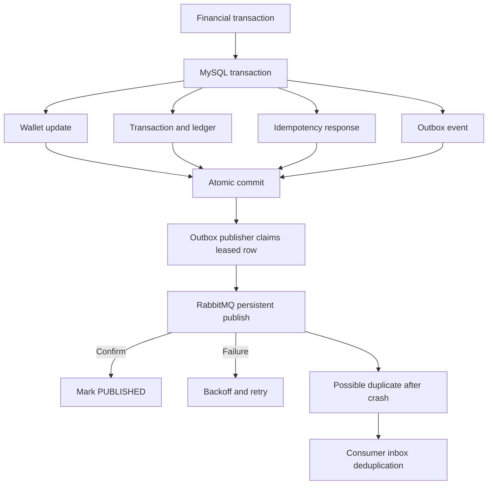

# Transactional Outbox Flow

```mermaid
flowchart TD
    A[Financial transaction] --> B[MySQL transaction]
    B --> C[Wallet update]
    B --> D[Transaction and ledger]
    B --> E[Idempotency response]
    B --> F[Outbox event]
    C --> G[Atomic commit]
    D --> G
    E --> G
    F --> G
    G --> H[Outbox publisher claims leased row]
    H --> I[RabbitMQ persistent publish]
    I -->|Confirm| J[Mark PUBLISHED]
    I -->|Failure| K[Backoff and retry]
    I --> L[Possible duplicate after crash]
    L --> M[Consumer inbox deduplication]
```
