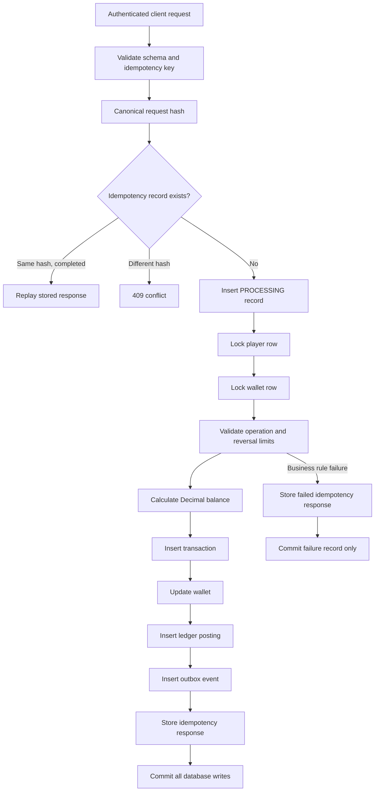

# Transaction Flow

```mermaid
flowchart TD
    A[Authenticated client request] --> B[Validate schema and idempotency key]
    B --> C[Canonical request hash]
    C --> D{Idempotency record exists?}
    D -->|Same hash, completed| E[Replay stored response]
    D -->|Different hash| F[409 conflict]
    D -->|No| G[Insert PROCESSING record]
    G --> H[Lock player row]
    H --> I[Lock wallet row]
    I --> J[Validate operation and reversal limits]
    J --> K[Calculate Decimal balance]
    K --> L[Insert transaction]
    L --> M[Update wallet]
    M --> N[Insert ledger posting]
    N --> O[Insert outbox event]
    O --> P[Store idempotency response]
    P --> Q[Commit all database writes]
    J -->|Business rule failure| R[Store failed idempotency response]
    R --> S[Commit failure record only]
```
